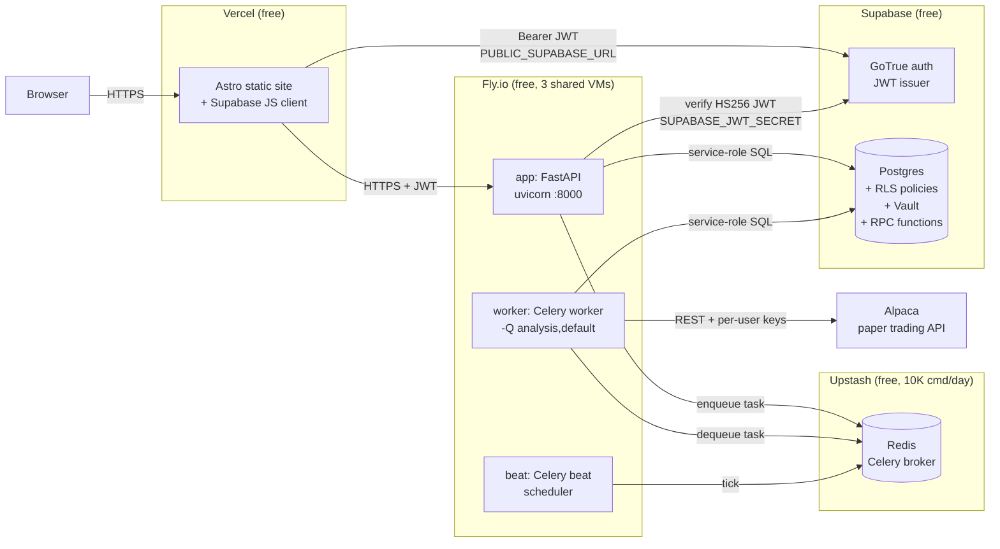

# Deploy multi-tenant TradingAgents stack to Fly.io + Vercel

## Summary

Stand up the existing multi-tenant TradingAgents SaaS (FastAPI backend + Celery worker/beat + Redis + Astro frontend + Supabase DB/auth) on free-tier cloud infrastructure so the product is reachable on public HTTPS URLs and can be demoed to investors.

## Problem Frame

The product currently runs locally via `docker compose`. Per the strategy's Track A ("Hosting & multi-tenancy"), the goal is to get off local and onto free-tier hosting. Multi-tenancy code already exists in the repo — `user_id` columns on every table, RLS policies, Supabase JWT auth dependency in `backend/auth.py`, and per-user scoping in `backend/db.py`. The work is deploy, not implementation: provision a real Supabase project, apply migrations, deploy each process, wire secrets, verify end-to-end that auth and per-user data scoping hold in production, and seed a demo user with sample analyses so an investor landing on the URL sees a populated dashboard.

The decision of hosting target is the load-bearing choice — it shapes every deploy file, env model, and operational concern downstream.

## Requirements

**Deployment surface**

- R1. Frontend reachable on a public HTTPS URL backed by Vercel.
- R2. Backend API reachable on a public HTTPS URL backed by Fly.io.
- R3. Celery worker and Celery beat running as separate long-lived processes on Fly.io.
- R4. Redis reachable from backend and worker as the Celery broker.

**Multi-tenancy verification**

- R5. Unauthenticated request to a protected endpoint returns 401.
- R6. Authenticated user A receives only A's `trading_logs`, `portfolio_positions`, and `scouting_log` rows in API responses.
- R7. Authenticated user B cannot read A's rows even with A's UUID known.

**Seed for investor demo**

- R8. A demo user account exists with at least 5 completed analyses across different tickers, at least 1 open portfolio position, and a non-zero scout history.

**Cost posture**

- R9. Recurring cloud cost is $0/mo within stated free-tier limits (Supabase free, Fly.io free, Vercel free, Upstash free).

**Operational**

- R10. All secrets (Supabase keys, OpenRouter, Alpaca, Stripe) live in the host's secret manager, never in the repo or image layers.
- R11. Re-deploys are triggered by pushing to the main branch and complete without manual steps beyond the initial first-time setup.

## Key Technical Decisions

- **KTD-1. Hosting target: Fly.io for backend/worker/beat/Redis-broker, Vercel for Astro frontend.** Fly.io has a single CLI (`flyctl`), `fly.toml` config files, free tier with 3 shared VMs that maps cleanly to backend + worker + beat, and documented patterns for Celery. Vercel auto-detects Astro and deploys on git push — no config file needed for a static Astro build. Render lacks free Redis; Railway's $5/mo credit is not truly free; Oracle Cloud is more generous but heavier setup. This split keeps each service on the platform that handles it best and stays inside the "easiest to implement" constraint.
- **KTD-2. Redis: Upstash free tier (10K commands/day) as the Celery broker.** Fly.io has no free managed Redis. A Fly machine for Redis would consume the third free VM, leaving zero for beat. Upstash free tier covers Celery broker traffic for a POC workload without consuming the Fly VM budget. DB writes go to Supabase Postgres, not Redis, so the 10K cmd/day ceiling is comfortable.
- **KTD-3. Single Fly application with multiple processes, not separate Fly apps.** Sharing one app keeps secrets config (`fly secrets set`) in one place and lets backend/worker/beat share a Dockerfile. The free-tier cost is identical (one process per VM) and the operational surface is half the size. `fly.toml` `[processes]` section names each process; `fly scale` controls VM count per process group.
- **KTD-4. Supabase Auth + Postgres on the free tier as the single source of truth for users, tenancy, and persistence.** Already wired in code (`backend/auth.py`, `backend/db.py`, `frontend/src/lib/supabase.ts`). Provisioning is a Supabase project creation + running the existing seven migrations in order. No code changes to the auth flow.
- **KTD-5. Demo seed as a one-off script, not a migration.** Seed data is environment-specific (it lives in the demo Supabase project, not in the schema). A Python script (`scripts/seed_demo.py`) keeps the seed out of `migrations/` and makes it re-runnable without polluting the migration history.

## High-Level Technical Design

The deployed topology spans four providers, each handling what it does best:

Key properties:

- The browser only ever talks to Vercel (Astro static) and Supabase (auth). The Fly backend is reached indirectly via the Astro app's API client, which attaches the Supabase JWT.
- Backend, worker, and beat share one Fly application and one image; they differ only by command in `fly.toml [processes]`. Each runs on its own shared-cpu-1x VM.
- Postgres (Supabase) is the single source of truth. Redis is broker-only — no Redis state survives a deploy. The Astro build is static — no Astro state survives either.
- The free-tier budget is the binding constraint: 3 Fly VMs (backend, worker, beat), Upstash 10K cmds/day, Supabase 500MB DB + 50K MAUs, Vercel 100GB bandwidth. R9 codifies staying within this.

## Implementation Units

### U1. Provision Supabase project and apply migrations

**Goal:** A live Supabase project exists with the multi-tenant schema, RLS policies, vault, and credit RPCs all applied.

**Requirements:** R5, R6, R7 (the foundation they all depend on).

**Files:**

- `migrations/001_trading_logs.sql`
- `migrations/002_portfolio_positions.sql`
- `migrations/003_scouting_log.sql`
- `migrations/004_add_user_id.sql`
- `migrations/005_saas_tables.sql`
- `migrations/006_vault_helpers.sql`
- `migrations/007_credit_rpcs.sql`

**Approach:** Create the Supabase project from the dashboard, capture `SUPABASE_URL`, `SUPABASE_ANON_KEY`, `SUPABASE_SERVICE_KEY`, and `SUPABASE_JWT_SECRET`. Apply migrations in numeric order via the SQL editor (or `psql` against the project's connection string). Enable the `vault` extension under Database → Extensions before applying migration 006. After all migrations, sanity-check as the service role: `SELECT * FROM user_credits` returns empty, `SELECT proname FROM pg_proc WHERE proname IN ('debit_credit','credit_user','grant_free_credits','store_alpaca_keys','get_alpaca_keys')` returns five rows.

**Test scenarios:**

- Connect to the Supabase Postgres as service role and confirm every table from migrations 001-005 exists with the expected columns.
- Confirm RLS is enabled on `trading_logs`, `portfolio_positions`, `scouting_log`, `user_credits`, `credit_transactions`, `user_settings` via `SELECT relname, relrowsecurity FROM pg_class WHERE relname IN (...)`.
- As the `authenticated` role, insert into `trading_logs` for `auth.uid()` and confirm a second authenticated session with a different `auth.uid()` cannot read it.
- Invoke `debit_credit` for a user with balance 5; confirm balance becomes 4 and `credit_transactions` gains a row with `transaction_type='analysis_debit'`.

---

### U2. Initialize Fly.io app and deploy the FastAPI backend

**Goal:** The FastAPI backend is reachable at a public Fly URL and responds to `GET /health`.

**Requirements:** R2, R10.

**Dependencies:** U1 (needs Supabase env to function end-to-end).

**Files:**

- `Dockerfile.backend` (no changes — already suitable)
- `fly.toml` (new)
- `.dockerignore` (verify existing covers `node_modules`, `.git`, `.venv`, `.env`)

**Approach:** Install `flyctl`, run `fly launch` in the repo root with `--no-deploy` to generate `fly.toml` from `Dockerfile.backend`, then refine `fly.toml` to set `internal_port = 8000`, the `/health` check, and an `[env]` block for non-secret variables (`BACKEND_PORT=8000`, `ALPACA_PAPER=true`). Configure the single process group named `app` to run `uvicorn backend.main:app --host 0.0.0.0 --port 8000`. Apply secrets via `fly secrets set` for `SUPABASE_URL`, `SUPABASE_SERVICE_KEY`, `SUPABASE_JWT_SECRET`, `REDIS_URL` (placeholder until U4), `OPENROUTER_API_KEY`, `ALPACA_API_KEY`, `ALPACA_API_SECRET`, `STRIPE_SECRET_KEY`, `STRIPE_WEBHOOK_SECRET`. Deploy with `fly deploy`. Verify by hitting `https://<app>.fly.dev/health` and getting `{"status":"ok"}`.

**Test scenarios:**

- `GET /health` over HTTPS returns 200 with `{"status":"ok"}`.
- `GET /results` without `Authorization` header returns 401.
- `GET /results` with a malformed Bearer token returns 401.
- `fly logs` shows the uvicorn startup banner and no exceptions for 60 seconds after deploy.

---

### U3. Add Celery worker and beat as additional Fly processes

**Goal:** Celery worker and Celery beat run as long-lived processes alongside the backend, sharing the same image and secrets.

**Requirements:** R3, R10.

**Dependencies:** U2 (same Fly app), U4 (needs Redis URL).

**Files:**

- `fly.toml` (extend with `[processes]` and per-process `command`)

**Approach:** In `fly.toml`, add a `[processes]` section naming `app` (backend), `worker`, and `beat`. Worker command: `celery -A backend.celery_app worker --loglevel=info --concurrency=2 -Q analysis,default`. Beat command: `celery -A backend.celery_app beat --loglevel=info`. Scale each process group to one shared-cpu-1x VM via `fly scale count worker=1 beat=1 app=1` (this consumes the entire 3-VM free-tier budget). Deploy and verify in `fly logs` that both worker and beat boot without errors.

**Test scenarios:**

- `fly status` shows three process groups (`app`, `worker`, `beat`), each with one machine in `running` state.
- `fly logs --process worker` shows Celery worker `ready` and connected to Redis.
- `fly logs --process beat` shows Celery beat `Scheduler: Sending due task` within 30 seconds of boot.
- Trigger an analysis by calling `POST /test-task/NVDA` from a session authenticated against the deployed Supabase project; confirm `fly logs --process worker` shows the task being picked up.

---

### U4. Provision free-tier Redis as Celery broker

**Goal:** Redis is reachable from the Fly app's processes at `REDIS_URL`.

**Requirements:** R4.

**Dependencies:** U2 (Fly app must exist to set `REDIS_URL` as a secret).

**Files:**

- `fly.toml` (no change; secrets set via `fly secrets set`)
- `docker-compose.yml` (no change — local Redis stays for dev)

**Approach:** Create a free Upstash Redis database from the Upstash console (or its API). Copy the Redis URL (with TLS, `rediss://` scheme) and password. Set it as a Fly app secret: `fly secrets set REDIS_URL='rediss://default:<password>@<host>:<port>'`. Redeploy so backend, worker, and beat pick up the new value. Verify by checking worker logs show a successful Redis connection.

**Test scenarios:**

- `fly logs --process worker` shows no Redis connection errors for 60 seconds after deploy.
- `redis-cli -u $REDIS_URL PING` from any host returns `PONG`.
- Dispatching a Celery task from the backend via `POST /test-task/NVDA` causes the worker to process it within 10 seconds (proves broker is functional).

---

### U5. Wire Vercel deploy for the Astro frontend

**Goal:** The Astro frontend is reachable at a public Vercel URL, renders the login page, and forwards authenticated requests to the Fly backend with the Supabase JWT.

**Requirements:** R1, R10.

**Dependencies:** U2 (needs the public backend URL to set as `BACKEND_URL`).

**Files:**

- `frontend/src/lib/types.ts` (likely already references `BACKEND_URL` from env — verify)
- `vercel.json` (only if Astro defaults need overriding; usually unnecessary for a stock Astro build)

**Approach:** Connect the repo to Vercel. Set project root to `frontend/`. Configure environment variables: `PUBLIC_SUPABASE_URL`, `PUBLIC_SUPABASE_ANON_KEY`, `BACKEND_URL` (set to the Fly app's HTTPS URL). Vercel auto-detects Astro and runs `astro build`, serving the static `dist/` output. After the first deploy, hit the Vercel URL, sign in via Supabase magic link, and confirm authenticated requests reach the backend.

**Test scenarios:**

- Vercel URL serves the landing page without console errors.
- `POST /auth/v1/token` to Supabase from the browser returns a session; the resulting JWT is attached to subsequent API calls (inspect via browser devtools).
- Authenticated `GET https://<vercel>/results` (proxied to Fly backend) returns the user's logs scoped to `auth.uid()`.

---

### U6. End-to-end smoke test

**Goal:** A scripted runnable check verifies the full auth + per-user scoping flow against the deployed stack.

**Requirements:** R5, R6, R7.

**Dependencies:** U1, U2, U3, U4, U5 (whole stack deployed).

**Files:**

- `tests/test_e2e_deploy.py` (new)

**Approach:** A pytest-style script that signs up two test users via the Supabase Auth admin API (using the service role key, off the test path), then exercises the deployed backend: unauthenticated request → 401; user A `POST /test-task/NVDA` → task queued; user A `GET /results` shows one row; user B `GET /results` shows zero rows; user B `GET /results/{A's_log_id}` returns 404. The script is runnable from CI as a post-deploy gate.

**Test scenarios:**

- Unauthenticated `GET /results` against the deployed backend returns 401.
- User A and user B each get a valid session token via Supabase magic link or admin API.
- User A queues an analysis; the result row appears in A's `GET /results` with A's UUID.
- User B's `GET /results` is empty after A's task completes.
- User B's `GET /results/{A's_id}` returns 404 (RLS-scoped, not just authorization-checked).

---

### U7. Seed demo data for investor pitch

**Goal:** A demo user account exists with a populated dashboard so an investor landing on the URL sees substance, not an empty state.

**Requirements:** R8.

**Dependencies:** U6 (verified stack).

**Files:**

- `scripts/seed_demo.py` (new)

**Approach:** Idempotent Python script that, given `SUPABASE_URL` and `SUPABASE_SERVICE_KEY`, ensures a demo user exists (creates via admin API if missing), grants free credits, then inserts sample data scoped to that user: 5-10 `trading_logs` rows across different tickers (NVDA, AAPL, MSFT, TSLA, AMD) with varied ratings, 1-2 `portfolio_positions` rows, 2-3 `scouting_log` entries with realistic `macro_context` and `tickers_json`. Designed to be re-runnable: checks for existing rows before inserting, so the second run is a no-op. Documented in the script's docstring: set env vars, run `python scripts/seed_demo.py`.

**Test scenarios:**

- After running the script, the demo user has at least 5 rows in `trading_logs` spanning at least 3 distinct tickers.
- The demo user has at least 1 open row in `portfolio_positions`.
- The demo user has at least 1 row in `scouting_log`.
- The demo user has a positive `user_credits.balance`.
- Logging in as the demo user on the deployed frontend renders the populated dashboard.

---

## Scope Boundaries

### In scope

- Provisioning infrastructure on free tiers (Supabase, Fly.io, Vercel, Upstash).
- Applying existing migrations to a live database.
- Deploying the existing backend, worker, beat, and frontend code without changes to application logic.
- Wiring environment variables and secrets across services.
- Verifying multi-tenancy holds end-to-end against the deployed stack.
- Seeding a demo user with sample data.

### Deferred to Follow-Up Work

- **Stripe / billing UI integration** — `Stripe` checkout/portal/webhook code exists but is not configured against a live Stripe account. Belongs to a future track once billing is a product priority.
- **Frontend auth polish** — login UI, error states, session refresh. Out of scope for Track A per the strategy's confirmation that this track is deploy-only.
- **Custom domain + HTTPS certificate provisioning** — using default Fly/Vercel hostnames for the POC.
- **CI/CD automation beyond Vercel's git-push trigger** — no GitHub Actions workflows yet; Vercel auto-deploys on push, Fly deploys are manual `fly deploy` for now.
- **Production-grade observability** — relying on `fly logs` and Vercel's built-in logs. No log aggregation, alerting, or uptime monitoring yet.
- **Multi-agent pipeline quality improvements** — explicitly deferred per `STRATEGY.md` "Not working on" until post-POC data shows what fails.

### Outside this product's identity

- **Self-hosted deployment option** for the developer tier — called out as v2 in `PRD.md`. Not a free-tier cloud POC concern.
- **Team / org accounts** — single-user tenancy only for this POC.
- **SOC 2 / compliance** — enterprise tier concern, far outside POC scope.

## Risks & Dependencies

- **Free-tier capacity tight.** Three Fly shared VMs (256MB each) for backend, worker, beat is the entire free-tier budget. Any additional process (e.g., a second worker for a dedicated queue) requires either consolidating or paying. Mitigate by monitoring `fly dashboard` and accepting that a sustained uptick in analysis volume will require a credit-card-backed Fly plan.
- **Upstash Redis 10K cmd/day.** Celery broker traffic on a POC with low traffic stays well under this, but a burst (e.g., investor demo triggering many analyses) could push close. If hit, the broker will queue or reject. Mitigate by rate-limiting the demo and warning the investor if their session pushes usage.
- **Cold starts on Fly free tier.** Shared VMs can be evicted; cold-starts cause the first request after eviction to take several seconds. Acceptable for a POC demo but not for production. If problematic during investor demos, move the backend to a `shared-cpu-1x` dedicated-cpu machine at $1.94/mo.
- **Supabase free-tier pause.** Supabase pauses free projects after 7 days of inactivity. The demo will need a periodic ping or a scheduled analysis to stay alive. Document this in the seed script's docstring.
- **Demo seed idempotency depends on stable demo user UUID.** The seed script uses a fixed UUID; if Supabase resets the project (it won't, but worth flagging), the script recreates the demo user. Document the recovery flow.

## Sources & Research

- `backend/main.py` lines 145-540 — existing endpoint surface, all already auth-required via `Depends(get_current_user)`.
- `backend/auth.py` — Supabase JWT verification; HS256 against `SUPABASE_JWT_SECRET`, no network round-trip.
- `backend/db.py` — every read/write function accepts `user_id` and scopes queries via `.eq("user_id", user_id)`.
- `backend/vault.py` + `migrations/006_vault_helpers.sql` — per-user Alpaca credential storage via Supabase Vault with `SECURITY DEFINER` RPCs.
- `migrations/004_add_user_id.sql` — the user_id + RLS policy migration for existing tables.
- `migrations/007_credit_rpcs.sql` — atomic `debit_credit`/`credit_user` RPCs that prevent double-spend.
- `frontend/src/lib/supabase.ts` — frontend Supabase client with `apiFetch` that attaches the JWT to every backend call.
- `frontend/src/components/AuthGuard.tsx`, `frontend/src/components/LoginForm.tsx`, `frontend/src/components/UserNav.tsx` — frontend auth surface already wired.
- `Dockerfile.backend` — Python 3.11-slim image with `pip install -e ".[backend]"`; suitable for Fly without modification.
- `docker-compose.yml` — local dev stack; the production deploy replicates it as separate Fly processes instead of containers on one host.
- `PRD.md` — the upstream SaaS multi-tenant design document this plan executes on top of.
- `STRATEGY.md` — strategy anchor, especially Track A definition.